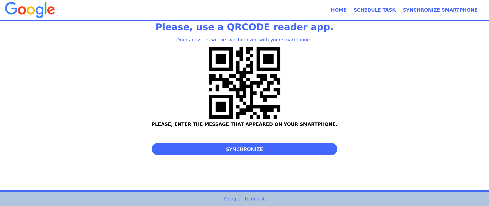
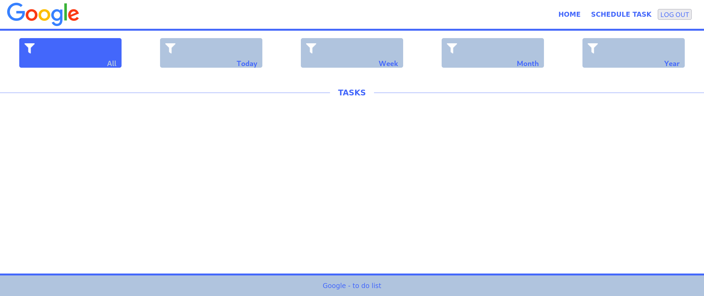
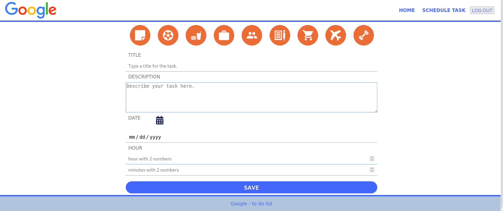
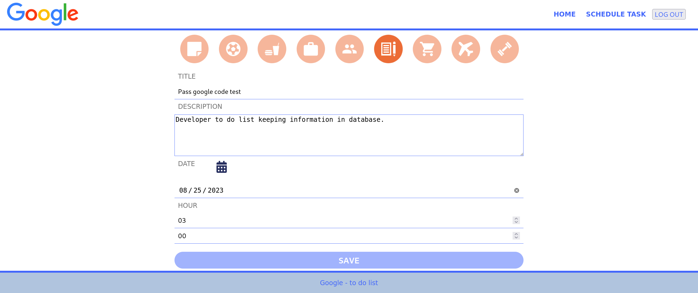
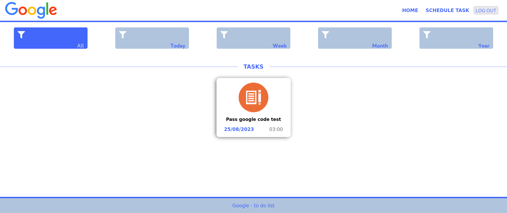

# To do list
This project is a monorepo

### Technologies used
* ReactJS
* Styled Components
* NodeJS (required version v16.20.2)
* Express
* MongoDB ( There is no need for any configuration. MongoDB just needs to be installed and running. )
* yarn ( package manager )


## First - MongoDB
1. Install MongoDB.
2. On linux (Debian/Ubuntu) run as root user: 
```
sudo service mongod start
```
3. Check if it´s running: 
```
sudo service mongodb status
```

## Second - API


### To run the project
1. Open a terminal in the project folder (API folder).
2. Download the dependencies with the command: 
```
yarn
```
3. Run the project with the command:
```
yarn start
```

## Third - Web

### To run the project
1. Open a terminal in the project folder (Web folder).
2. Download the dependencies with the command:
```
yarn
```
3. Run the project with the command:
```
yarn start
```

> **_NOTE:_**
I´m working on a new version Front end. You can follow here: https://github.com/pauloteixeira01/frontend-to-do-list

### With your smartphone, use an 'app' to scan the 'qrcode' and type the message in the field.


### On this screen will be all the tasks


### In this screen you will register a task.


### Registering the task


### Registered task card


### To view task details click on the card

